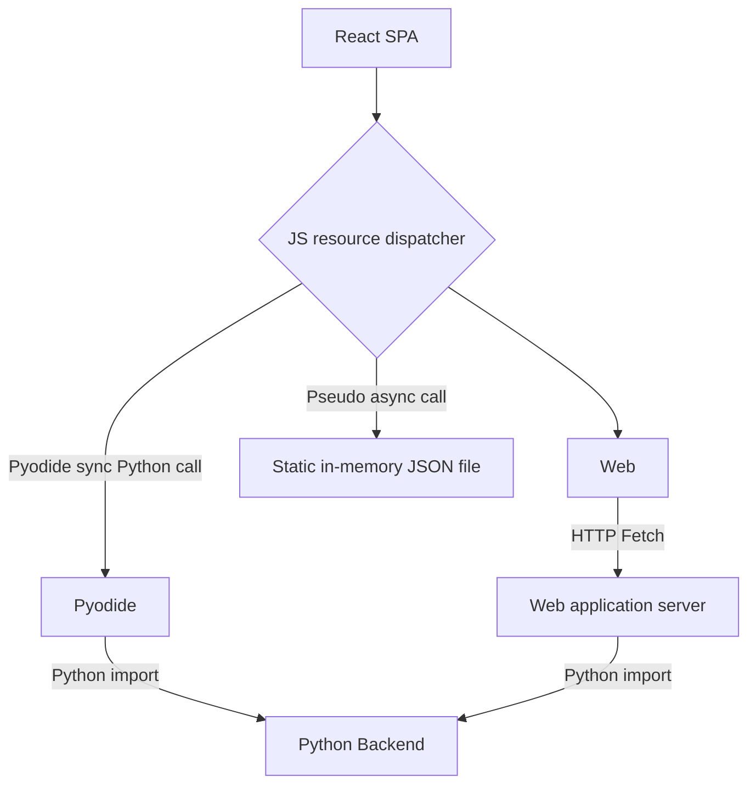

# CIN Validator Front-end: high-level proposed architecture outline

The CIN validator is intended to be the first iteration and use-case for the new SF RPC back-end architecture. This document outlines the intended approach and provides a jumping off point for further discussion and refinement.

## The Problem

The CIN validator tool, and likely further similar tooling, has a typical single-page web application architecure. It is, or will be, a React SPA with a decoupled back-end. This application deviates from the normal style, however, in that the back-end can be provided by a number of different resources, namely:

- A web application server with an exposed web API
- A Pyodide implementation operating as a web worker with a Python instance in a Web Assembly (wasm) layer
- A static data resource for demo purposes

These resources are singular - only one will be used at a time - but they should provide a consistent API for the front-end. Aside from some minor integration differences which can take place inside an FE adaptor, the requests for data and responses should be the same between the different resources.

## The Solution

We propose a Remote Procedure Call (RPC)-like system. A single conduit for data should be exposed by each resource. This conduit should receive an operation directive and a payload of data, and should return the appropriate data response. The shape of this directive, payload and response should be the same across all resources; the only difference should be the method used to call it.

This diagram shows the basic flow - the React front-end is set up with a value for the data resource it will use, at runtime. Depending on this value, it will request data from either a:

### Static resource

Here we should load a large JSON dataset into memory from a local URL. Our request operation directive should be a key for this object which selects a sub-blob of JSON, which is then returned. A payload should be sent but will be disregarded by the resource.

### Pyodide resource

Pyodide is loaded and setup to use wasm and the web worker environment. It loads the Python backend and requests sent from the frontend use the runPythonAsync method as a transport - the Python that React calls at this point is only ever the method used as the conduit for calls - we should name this something generic, for example "endpoint". Having called this method with a operation directive and a payload of data (likely JSON), it forwards the request to the function handler for the directive in question, which in turn performs the operation in Python and returns the response.

### Web application resource

Similarly to the Pyodide resource, this resource handles the operator by being called at the "endpoint" method and selectively forwarding the request to the appropriate handler. Indeed, in an ideal world, this resource should use _exactly the same codebase_ as Pyodide. However, it should wrap the code in some form of web application framework which can receive the request (operation directive and payload) at a url endpoint, which in turn forwards to the generic endpoint method, and then finally to the specific method in question.

## Benefits

The intention behind this architecture is to make the backend pluggable. The frontend becomes data later agnostic with a consistent interface which should respond in an identical fashion, regardless of the method used. This allows us to transparently substitute Pyodide for a (for example) a Flask implementation over an HTTP connection with no impact on the functionality of the application. It should also give us an architectural guideline for future additions to this list of resource as needed - and it should be fairly simple to handle future enhancements, like status message subscriptions over a pubsub and long-poll/websocket connection.
